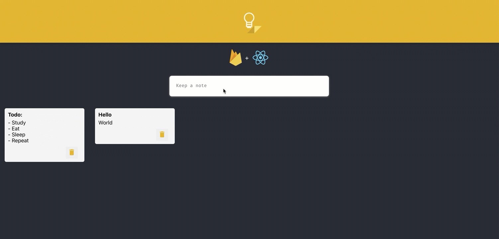

# google-keep

A notes app inspired by google's keep note taking app.

## Deployed Site/Demo

- [Deployed Site](https://aa-notes.com/)

## Installation

## Tech Stack

**Client:** React, Styled Components
**Server:** Firebase

## Screenshots



## Run Locally

Clone the project

```bash
  git clone https://link-to-project
```

Go to the project directory

```bash
  cd my-project
```

Install dependencies

```bash
  npm install
```

Start the project

```bash
  npm run start
```

## Acknowledgements

- [Awesome README](https://github.com/matiassingers/awesome-readme)
- [How to write a Good readme](https://bulldogjob.com/news/449-how-to-write-a-good-readme-for-your-github-project)

## License

[](https://github.com/tterb/atomic-design-ui/blob/master/LICENSEs)

[MIT](https://choosealicense.com/licenses/mit/)
